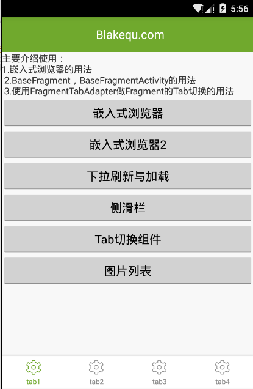

# BasePlusubLib
=======

A base frame library for Android



For more information please see [the website][1]
using this frame you can see [help document](website/using_info.pdf)

Permission
--------
<uses-permission android:name="android.permission.ACCESS_WIFI_STATE" />
    <uses-permission android:name="android.permission.CHANGE_WIFI_STATE" />
    <uses-permission android:name="android.permission.ACCESS_NETWORK_STATE" />
    <uses-permission android:name="android.permission.MOUNT_UNMOUNT_FILESYSTEMS" />
    <uses-permission android:name="android.permission.WRITE_EXTERNAL_STORAGE" />
    <uses-permission android:name="android.permission.INTERNET" />
    <uses-permission android:name="android.permission.ACCESS_DOWNLOAD_MANAGER" />
    <uses-permission android:name="android.permission.DOWNLOAD_WITHOUT_NOTIFICATION" />
    <uses-permission android:name="android.permission.CHANGE_NETWORK_STATE" />
    <uses-permission android:name="android.permission.KILL_BACKGROUND_PROCESSES" />

Download
--------

Download [the latest JAR][2] or grab via Gradle:
```groovy
compile 'com.plusub.lib:PlusubBaseViewLib:1.0.2'
```
or Maven:
```xml
<dependency>
  <groupId>com.plusub.lib</groupId>
  <artifactId>PlusubBaseViewLib</artifactId>
  <version>1.0.2</version>
  <type>pom</type>
</dependency>
```

if you want use base lib(not content view, you can via Gradle):
```groovy
compile 'com.plusub.lib:PlusubBaseLib:1.0.2'
```
or Maven:
```xml
<dependency>
  <groupId>com.plusub.lib</groupId>
  <artifactId>PlusubBaseLib</artifactId>
  <version>1.0.2</version>
  <type>pom</type>
</dependency>
```


ProGuard
--------
notice:
1.不能混淆使用com.plusub.lib.annotate注解的类
2.添加下面默认混淆的选项

If you are using ProGuard you might need to add the following option:
```
-keepnames class * implements java.io.Serializable
-keepclassmembers public class * extends android.view.View {
   void set*(***);
   *** get*();
}
-keep class * implements android.os.Parcelable {
  public static final android.os.Parcelable$Creator *;
}
-keepnames class * implements java.io.Serializable
-keep public class * extends com.plusub.lib.activity.BaseActivity{
    <fields>;
}
-keep public class * extends com.plusub.lib.activity.BaseFragment{
     <fields>;
 }
-keep public class * extends com.plusub.lib.activity.BaseFragmentActivity{
    <fields>;
}

-keep class com.nostra13.universalimageloader.** { *; }
-keep class de.greenrobot.event.** { *; }
```


License
--------

    Copyright 2013 Square, Inc.

    Licensed under the Apache License, Version 2.0 (the "License");
    you may not use this file except in compliance with the License.
    You may obtain a copy of the License at

       http://www.apache.org/licenses/LICENSE-2.0

    Unless required by applicable law or agreed to in writing, software
    distributed under the License is distributed on an "AS IS" BASIS,
    WITHOUT WARRANTIES OR CONDITIONS OF ANY KIND, either express or implied.
    See the License for the specific language governing permissions and
    limitations under the License.

about Author
--------
1. email:blakequ@gmail.com
2. website:www.blakequ.com, if you have any question, you can send email, thank you!
3. how to using this frame, you can see [help document](website/using_info.pdf)

 [1]: http://www.blakequ.com